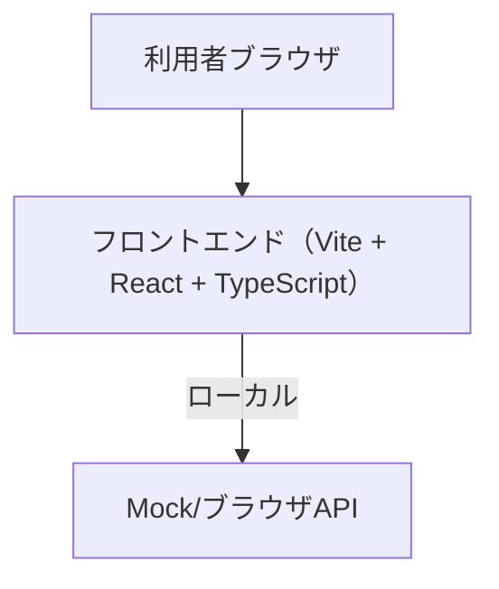
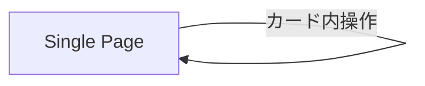

# 基本設計書（本プロジェクト）

## システム名：React Hooks サンプル実行アプリ

作成日：2025 年 10 月 28 日  
作成者：プロジェクトチーム

---

## 1. システム概要

本システムは、React 公式の各種 Hooks（`useState`/`useEffect`/`useContext`/`useReducer`/`useRef`/`useMemo`/`useCallback`/`useLayoutEffect`/`useImperativeHandle`/`useDebugValue`/`useTransition`/`useDeferredValue`/`useId`/`useSyncExternalStore`/`useInsertionEffect`）を、UI から個別に「Run / Reset」できる形で体験・検証するための Web アプリケーションである。  
主な機能は以下の通り。

- 各 Hook のデモ実行（Run/Reset トリガで状態変化）
- テーマ（ダーク/ライト）の切替
- カスタムフック（簡易 `useFetch`）の挙動確認

---

## 2. システム構成

### 使用技術

| 区分           | 技術要素                                                        |
| -------------- | --------------------------------------------------------------- |
| フロントエンド | React 18 / TypeScript / Vite / @vitejs/plugin-react             |
| UI             | 素の CSS（`src/styles.css`）                                    |
| 状態管理       | 各種 React Hooks / 簡易外部ストア（`useSyncExternalStore`向け） |

---

## 3. 機能一覧

| 機能 ID | 機能名         | 概要                                  | 画面 ID |
| ------- | -------------- | ------------------------------------- | ------- |
| F001    | Hook デモ実行  | 各カードで Run/Reset により挙動を確認 | SCR001  |
| F002    | テーマ切替     | ダーク/ライト切替（ThemeContext）     | SCR001  |
| F003    | カスタムフック | `useFetch` による簡易取得デモ         | SCR001  |

---

## 4. 画面設計概要

### 4.1 画面遷移図

### 4.2 ワイヤーフレーム（概要）

- 単一画面にカード状で各 Hook デモを配置
- 各カード上部に「Run」「Reset」ボタン、下部に結果表示領域
- 右上ヘッダでテーマ切替（ダーク/ライト）

---

## 5. データ構造概要

本アプリはサーバを持たない学習用であり、DB は利用しない。`useSyncExternalStore`デモのために、1 秒ごとに値がインクリメントされる簡易外部ストア（`src/store/tickStore.ts`）を持つ。

---

## 6. 外部インターフェイス概要

| 区分 | 連携先              | 内容                              | 通信方式   |
| ---- | ------------------- | --------------------------------- | ---------- |
| Mock | ブラウザ内 Blob URL | `useFetch` デモのダミーデータ取得 | fetch/JSON |

---

## 7. 非機能要件

| 区分           | 要件                                                                      |
| -------------- | ------------------------------------------------------------------------- |
| パフォーマンス | ローカル開発でストレスなく操作できる（1000 件程度の配列生成で停止しない） |
| 可用性         | ローカルで完結、起動/停止を容易にする（Vite）                             |
| セキュリティ   | インターネット通信なし（学習用途）                                        |
| 保守性         | Hook デモを `src/views/*Demo.tsx` に分割し拡張容易                        |

---

## 8. 付録

- 起動方法：`npm install` → `npm run dev`
- 参照ファイル：`src/ui/App.tsx`、`src/ui/TestCard.tsx`、`src/theme/ThemeContext.tsx`

---

💡 **ポイント**

- サンプルの動きを読みやすくするため、1 カード=1 デモの単純構成
- 実運用の前に、Hook の理解やパフォーマンステストを行う土台として利用
