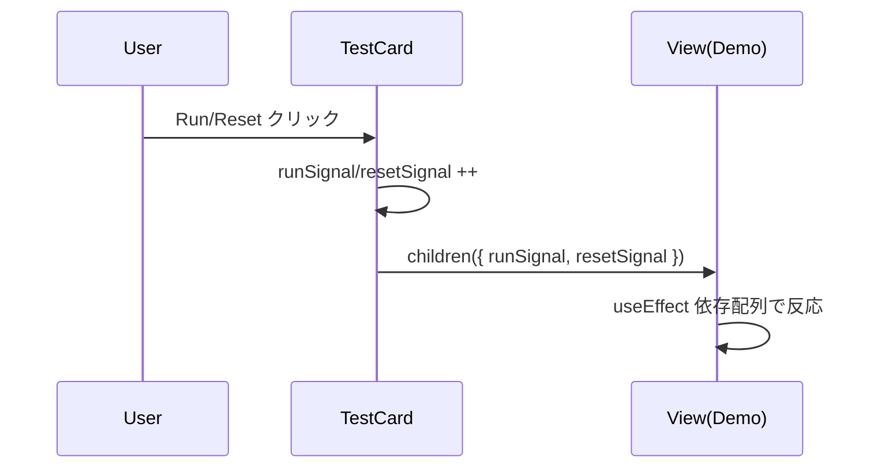
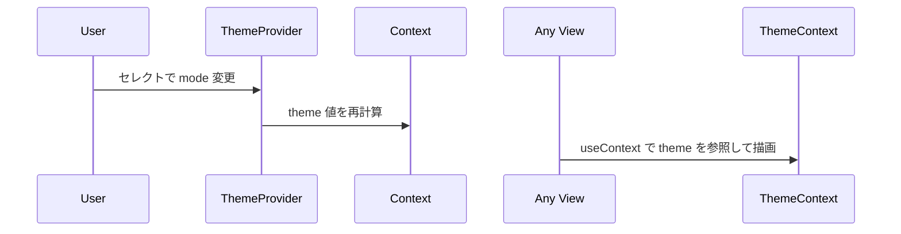

# 詳細設計書（本プロジェクト）

## システム名：React Hooks サンプル実行アプリ

作成日：2025 年 10 月 28 日  
作成者：プロジェクトチーム

---

## 1. システム構成図

```mermaid
graph TD
A[ブラウザ(React18)] --> B[Vite Dev Server]
A --> C[ブラウザAPI(fetch/Blob/DOM)]
A --> D[外部ストア tickStore]
```

---

## 2. モジュール/コンポーネント設計

### 2.1 モジュール一覧

| モジュール名               | 役割           | 主な処理                                              |
| -------------------------- | -------------- | ----------------------------------------------------- |
| src/ui/App.tsx             | 画面構成の中核 | デモカードをグリッド表示、各デモを配線                |
| src/ui/TestCard.tsx        | 共通カード     | Run/Reset ボタンとレンダープロップでデモに信号を渡す  |
| src/theme/ThemeContext.tsx | テーマ管理     | ダーク/ライトのテーマ値提供（背景/文字色）            |
| src/views/\*Demo.tsx       | 各 Hook のデモ | デモ本体。`DemoProps` を受けて動作                    |
| src/hooks/useFetch.ts      | カスタムフック | 簡易 fetch（Abort 対応）、モック URL 生成             |
| src/store/tickStore.ts     | 外部ストア     | `useSyncExternalStore` 用の購読対象（1 秒でカウント） |

### 2.2 主要インターフェイス

```ts
// src/ui/TestCard.tsx
export type DemoProps = { runSignal: number; resetSignal: number };
// children は function-as-children
children: (signals: DemoProps) => React.ReactNode;
```

---

## 3. 処理フロー設計

### 3.1 Run/Reset トリガ更新フロー



### 3.2 テーマ反映フロー



---

## 4. 入出力仕様（対象関数/Hook）

| 名称               | 入力                 | 出力                     | 備考                 |
| ------------------ | -------------------- | ------------------------ | -------------------- |
| TestCard(children) | Run/Reset ボタン操作 | `DemoProps` を子に渡す   | レンダープロップ     |
| useFetch(url)      | URL                  | { data, error, loading } | AbortController 対応 |
| tickStore          | なし                 | getSnapshot() 数値       | 1 秒毎に +1          |

---

## 5. 例外/エラー方針

| 発生箇所 | 想定エラー        | 対応                                       |
| -------- | ----------------- | ------------------------------------------ |
| useFetch | HTTP エラー/Abort | `error` に格納、UI で表示                  |
| 各デモ   | 実行時例外        | 例外を握りつぶさずブラウザコンソールに出力 |

---

## 6. ログ/開発補足

### 6.1 ログ

- 本アプリは学習用のため、ブラウザコンソールログで十分とする。

### 6.2 開発・運用

- 起動: `npm install` → `npm run dev`
- ビルド: `npm run build` → `npm run preview`
- 型: `npm run typecheck`

---

## 7. テスト観点

| 観点                 | 操作                          | 期待結果                               |
| -------------------- | ----------------------------- | -------------------------------------- |
| Run/Reset            | 各カードの Run/Reset          | `useEffect` 等がトリガされ表示が変わる |
| テーマ               | テーマセレクト切替            | 背景/文字色が切替わる                  |
| useFetch             | Fetch ボタン                  | data に JSON（モック）が表示される     |
| useSyncExternalStore | Run → tick 開始、Reset → 停止 | 値が加算/停止する                      |

---

💡 **ポイント**

- 各デモは独立性を重視し、外部依存を持たない（学習効率のため）。
- Run/Reset の信号方式により、デモごとに簡単に初期化・再実行が可能。
